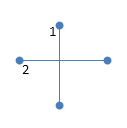
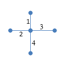
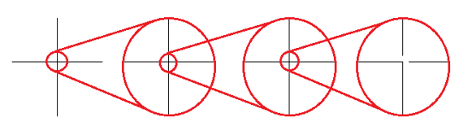
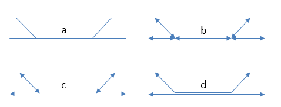
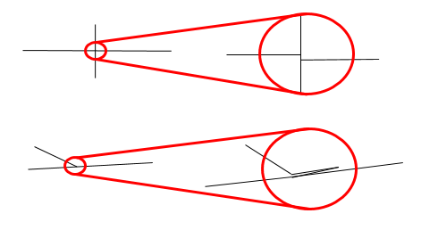
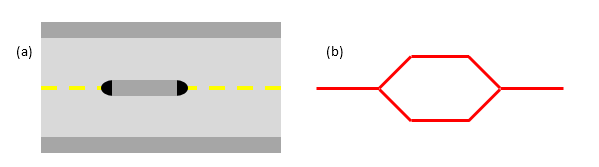

.. _`network preparation`:

*******************
Network Preparation
*******************

The phrase “garbage in, garbage out” applies to spatial network analysis
just as much as it applies to all modelling.  Careful preparation of spatial networks for analysis is essential to getting a meaningful result.

This chapter is a much needed guide to the pitfalls we have found in
preparing data for spatial network analysis. Hopefully by following it
you can avoid the mistakes we used to make, and have seen others make.
Although this guide now forms part of the sDNA manual, it applies equally well to any other form of spatial network
analysis.

We present the material as follows

* :ref:`Principles` discusses the types of errors that appear in spatial networks and how, in theory, to correct them
* :ref:`Tools` discusses specific tools that can be used to achieve this correction, depending on your working environment
* :ref:`Notes on specific formats` contains notes on preparing some commonly used network formats

.. _principles:

Principles
**********

The relationship between data quality, and analysis quality, is not linear.  A single error in a critical place could invalidate an entire analysis; meanwhile, numerous errors in non-critical places can have negligible effect.  

Three classes of error should be treated as a matter of priority in spatial network analysis:

* :ref:`Data in a misleading format`
* :ref:`Connectivity errors at key locations`
* :ref:`Geometry errors at key locations`

.. _Data in a misleading format:

---------------------------
Data in a misleading format
---------------------------

.. _Connectivity rules:

Connectivity rules
------------------

It’s easy to assume, just because the software appears to successfully
load your data, that the data was in the right format; indeed it is easy to presume that if the format was 
wrong, the data would have failed to load.  With spatial network data this is often not the case.

Software will certainly complain if it doesn’t recognise a given GIS and
CAD file format (like a shapefile, geodatabase or DWG). But each of
these formats are restricted to describing two things, *shapes* and
*data*. What they don’t describe is the *meaning* of those shapes and
data. For example, a shape file could contain two lines which cross like
this (blobs are used to make it clear where lines start and end):

.. _crossinglines:

   
   Two lines in a shapefile, but what do they mean?

As it stands, that’s just two intersecting lines. But suppose you knew that the lines represent a street network. Now they have a
*meaning* - but the meaning isn’t quite clear yet. Are we looking at a
crossroads, where two streets join, or a bridge, where one is crossing
over another? To answer that question, we need to specify a
*connectivity rule* for the data.

sDNA processes spatial networks encoded using a **coincident endpoint
connectivity rule.** This is a common standard used in many data sets
e.g. Ordnance Survey products as well as other
software such as ArcGIS Network Analyst.
(Provided you take grade separation into account. Ordnance survey
specify grade separations for each end of a link, and links only join
if their grade separations match).

    The **coincident endpoint connectivity rule**

    1. A network is formed by a collection (feature set) of polylines  
    2. Lines are deemed to be connected if and only if they have coincident endpoints (the lines must end on exactly the same point).

So, as far as sDNA is concerned, the two lines in :num:`Figure #crossinglines` don’t
connect, because they have different endpoints. They simply intersect
one another, and could either represent a bridge or a tunnel.  This category is so common that it has its own name,
a *brunnel* (or, in honour of the Victorian engineer, a *brunel*).  These features are also called *unlinks*, because the lines represent objects which are not linked.

:num:`Figure #crossinglines` does not, however, represent a crossroads – and a crossroads is
usually what the designer intended. This is a serious data error.  The representation of a
crossroads, using coincident endpoint connectivity, requires four
separate lines:

.. _crossinglinesnoded:

   Four lines in a shapefile, representing a crossroads according to
   *coincident endpoint connectivity rules*

If the junctions in your network are formatted like :num:`Figure #crossinglines`, not :num:`Figure #crossinglinesnoded`, 
then all network analysis done by software expecting coincident
endpoints will be completely meaningless. This cannot be emphasized
enough – it may seem obvious, but I have often seen this mistake made in
practice, because (unless the software is set to display blobs on the
ends of lines, as I have in this document) the two formats both load correctly and look identical to the viewer.

Another reason this mistake is often made is that drawing networks using
a coincident endpoint connectivity rule is tedious, time-consuming,
painful and error-prone. The designer has to draw a lot more lines than
they would otherwise need to, and those lines don’t really seem to match
up with the way we (as humans) think about space. For these reasons,
people don’t like to draw networks with coincident endpoint
connectivity. This is absolutely fine – avoiding a tedious and
error-prone task is to be encouraged. But it is vital that the networks
thus produced are converted to coincident endpoint connectivity before
analysis.

Of course, if you draw crossroads in the style of :num:`Figure #crossinglines`, how would
you then indicate which of these are bridges or tunnels (brunels)
rather than crossroads? By using some different connectivity rules:

    **Alternative connectivity rules**
    
    * *Link-Unlink (polygon) rule*.  Intersecting links are assumed to join unless they are specifically marked otherwise.  This is done with a separate layer of unlinks (drawn as polygons).  This is an easy format to draw by hand.
    * *Link-Unlink (data) rule*.   Intersecting links are assumed to join unless they are specifically marked otherwise.  This is done by having a brunel data field attached to each line.  This is an easy format to draw by hand.
    * *Link-Endpoint Grade Separation rule*.  Intersections are not allowed in the data at all; ALL lines where they touch MUST have coincident endpoints.  Where links don’t join at their endpoints this is shown by providing elevation or grade separation data – two data fields attached to each line, one for the line start and the other for its end.  (OS ITN does this).
    * *Link-Node rule*.  Intersections are not allowed in the data at all; ALL lines where they touch MUST have coincident endpoints.  Where links don’t join at their endpoints this is shown by providing elevation or grade separation data – endpoints are assumed not to join unless their elevation and grade separation match.  This data is provided in a separate layer of points, cross-referenced to the lines whose elevations they represent (OS Meridian does this).
    * *Shared point rule* Lines do not intersect unless they share a point in the list of points representing the line in the data. This could be an endpoint, or any corner in the line itself, or even added without a corner to create an intersection. OpenStreetMap uses this rule, though refers to all points within the lines as 'nodes'; in this document I reserve use of 'nodes' for places where links are connected.
    
    Note one advantage of the latter two formats is that intersecting lines are not allowed at all; therefore any detected by software are guaranteed to be data errors.  Catching errors in data is an important function we discuss later.

The problem then remains to convert from these other formats to a network
with a coincident endpoint connectivity rule.

-  **For link-unlink (polygon) rule**, sDNA for Autocad includes a tool
   to convert the network. If you need this tool for GIS, drop us a line
   – nobody has asked for it yet but we can look at making it.
   Alternatively, in any GIS system, convert the network to link-unlink
   (data) format as follows:

   -  use the unlink polygon layer to split links at unlink polygon
      boundaries

   -  create a *brunel* data field on the link layer

   -  select links within the polygons of the unlink layer, and mark
      them as *brunels* in the data field

   -  your network is now in link-unlink (data) format. Follow the steps
      below to convert **link-unlink (data)** into coincident endpoint
      format.

-  **For link-unlink (data) rule**, use a `Break intersections`_
   tool to break all lines except for
   brunels. Split the layer into two separate layers; one for brunels,
   the other for the rest of the links. Break intersections on the link layer, then
   rejoin the layers. 

-  **For Link-Endpoint Grade separation rule**, there is no need to
   convert. All sDNA tools accept start- and end-grade separation data
   attached to links; endpoints will be assumed to connect if and only
   if their grade separations match.

-  **For Link-Node rule**, get in touch with us – although they are not
   released to the public yet, we have some tools to do this.
   
- **For Shared point rule** use a :ref:`Shared point line breaker` 

**Summary:  ensure you understand spatial network
connectivity rules, and (for sDNA) that your network uses coincident endpoint
connectivity.**

.. _`projection`:

Spatial reference
-----------------

Returning to :num:`Figure #crossinglines` and :num:`Figure #crossinglinesnoded`, even though we may know what the lines
represent – and their connectivity rule – we still don’t know what the
coordinates represent. This is the *spatial reference* of the data. The
issue is important both when creating new data, and when
downloading existing data from other sources.

Spatial references can either be Geographic or Projected. Geographic
coordinate systems specify a position on the surface of the earth, by
measuring angles of latitude and longitude from the earth’s axis. WGS84,
the dominant global standard for GPS and mapping data, is an example of
this.

While geographic coordinate systems describe a curved surface, projected
coordinate systems simplify the representation of small areas by making
the approximation that they are flat. Each country usually has a
national grid to use for this purpose, based on x and y coordinates.

To analyse a network, you probably want to use units of distance that
have some physical meaning to you – metres, miles or kilometres. If you
have downloaded data that uses a geographic coordinate system, this
usually means you will need to convert (project) it using your GIS or
CAD software.

Unfortunately, not everybody in the world understands spatial
references. This means that sometimes, data you receive may be marked
with the wrong spatial reference – watch out!

Another problem which can arise, is that the GIS software you use may
not correctly identify the transform needed to project the data you
downloaded onto a sensible grid. So, it is best to double check, and
manually select the correct transform if needed.

In the case of sDNA, if you are not sure whether your data is projected
properly, you can check what sDNA ‘sees’ as the length of links by
running the sDNA Individual Line Measures tool.  You can then check what sDNA reports for the
length of one or two different links. Is it what you expected? If not,
you probably have the wrong spatial reference and will need to reproject
your data.

.. _Connectivity errors at key locations:

------------------------------------
Connectivity errors at key locations
------------------------------------

Even though you may have used the correct connectivity rule for your
network, it is possible that you or somebody else made a mistake when
drawing it. :num:`Figure #faultycrossroads` shows the same network as figure 2, at four levels
of increasingly greater magnification:

.. _faultycrossroads:

   Zooming in on a faulty crossroads

Oh no! What looked like a perfectly normal crossroads from a distance,
turned out to be disconnected when we zoomed in. This is potentially a
very serious error. If you want an accurate model, this is of course
unacceptable – but even if you only want an approximate network model,
if such a disconnection is in a key location (such as a major through
route in a city) then the entire analysis could be meaningless, even for
a rough model.

The following sections deal with this, and other, forms of connectivity
error.

Cluster tolerance
-----------------

We first introduce the idea of a *cluster tolerance*. This is a small
distance; on an urban scale perhaps 1cm (though larger cluster
tolerances can be useful sometimes). If two points are closer than the
cluster tolerance, then they are considered to be the same point. sDNA
supports two types of cluster tolerance, XYTolerance for horizontal
differences between points, and ZTolerance for vertical differences.

Note that some GIS systems, notably ArcGIS, will display unconnected
lines as connected – no matter how closely you zoom in – if the
disconnection is smaller than the cluster tolerance of the GIS! So, we
have to be very careful about whether lines are connected, because we
may not even be able to see errors, regardless of how closely we look.

The sDNA Prepare tool supports fixing of disconnections smaller than the
cluster tolerance. In the case of :num:`Figure #faultycrossroads`, if you set a suitable
cluster tolerance then sDNA Prepare will connect the lines (provided the
network in :num:`Figure #faultycrossroads` actually consists of four lines, rather than two –
see :ref:`Connectivity rules`). sDNA cluster tolerance applies only to the endpoints
of lines, not any points in between. In ArcGIS, sDNA uses whatever
tolerance ArcGIS is using by default, though a custom tolerance can also be
set.  On other platforms, the tolerance defaults to zero, i.e. no correction is performed.

But, let’s say you have downloaded some network data of unknown quality.
How can you tell what cluster tolerance to use? Too small, and you will
disconnect things that should be connected; too big, and you will
connect things that should be disconnected.

The answer is to use sDNA Prepare to detect (but not fix) cluster
tolerance errors.

    **Fixing a network with unknown cluster tolerance**
    
    1. Start with a small tolerance size
    
    2. Use sDNA prepare to detect tolerance problems (“Edge endpoints closer than cluster/XYTolerance”), and examine the errors it finds.  
    
    3. Are the features detected all errors, or are some of them genuine small gaps that should not be connected? 
    
        a. If all the features detected are genuine, then the network is ready to use.
        
        b. If some - but not all - of the features are genuine, choose a smaller tolerance, and go back to step 2.
        
        c. If all of the features are errors, use sDNA prepare to fix them.  Then, choose a larger tolerance and go back to step 2.
        
        d. If no features are detected at all, then choose a larger tolerance and go back to step 2. If you keep alternating between (b) and (d) above, then the errors and genuine features are the same size.  This means the network is of very poor quality and must be fixed by hand.  

Intersections and overlaps
--------------------------

Another kind of connectivity error can arise when lines intersect or
overlap. Really this is a restatement of :ref:`Connectivity rules`, but here we focus on errors that can happen when encoding the
endpoint connectivity rule, rather than choosing the wrong rule
altogether.

.. _faultyjunctions:

    (a) a pair of junctions; (b) correct set of lines to represent
    junctions (arrowheads included to show endpoints); (c) incorrect set of
    lines to represent junctions - intersection error; (d) incorrect set of
    lines to represent junctions – overlap error. The parallel lines in (d)
    actually overlap, they are shown here slightly separated for clarity.

:num:`Figure #faultyjunctions` shows a set of two junctions (a), represented correctly (b) and
also incorrectly (c, d). Note how use of arrowheads at both ends of each
line allows you to see errors more clearly – when checking a network, it
is recommended practice to configure your GIS to do this [2]_.

.. [2]
   In ArcGIS the arrow settings are rather well hidden. Look at *layer
   properties -> symbology -> symbol -> edit symbol -> set type to
   “cartographic line symbol” -> line properties*. 

These kinds of errors can be fixed using `Topology`_ tools.  If grade separation data is present, care must be taken that that breaking intersections does not move the grade separation data to the wrong
link: it is advisable to search for all nonzero grade separations and check them by hand after line breaking operations.

We recommend breaking links where bridges/tunnels exist, so
long as grade separation data is correctly attached to these. This has
the advantage that *all intersections become errors*: if you see an
intersection, you can be sure it is a mistake in the network rather than
a brunel, as the latter would be coded with grade separation data. A
similar policy can be applied to *loop links* which start and end at the
same point (such as a circular cul-de-sac). If these are deliberately
broken into two links rather than one, you can be certain that all loop
links are errors also. This prevents the drawing of e.g. a roundabout
that is not connected to anything.

Incorrect grade separation, elevation and oneway data
-----------------------------------------------------

A third kind of connectivity error arises when grade separation,
elevation or one-way information is incorrect. In the former cases, even
overlapping endpoints will be wrongly assumed disconnected if the grade
separation or elevation data is wrong. In the latter case, a one-way street pointing
the wrong way can lead to an impossible situation.

The way to check this kind of information is to display it and have a
look. If you have grade separation data, it will take the form of two
data fields on each link – one for each end of the link (in sDNA, these
are usually called start\_gs and end\_gs). The start and end of a line
refer to the way it was drawn – note this is *not necessarily the same
direction as the flow of a one-way link.* So, for start and end grade
separation to be interpretable, the GIS should be set to display arrowheads only at the
end of lines, to make clear which end the start and end grade separation
refer to.

In ArcGIS, you can get custom labelling of link start and end grade
separation from the *Layer properties -> label features* dialog. Turn on
labelling and in *Placement properties* choose *Place one label per
feature.* Click on *Expression* to create a label from multiple fields.
The following is an example of an expression that labels each link with
connectivity, start and end grade separations; putting the grade
separations in brackets for easier reading::

    [LConn] & " (" & [start\_gs] & "/" & [end\_gs] & ")"

(For more information on computing and checking connectivity, see the
following section).

To display one-way data, it is best to show an arrow in the direction of
the one-way street. In ArcGIS this can be achieved using a ‘categories’
symbology to show a forwards, backwards or no arrow depending on one-way
information attached to the street.

sDNA allows for elevation (z) data to be provided separately to grade separation.  At first
glance this seems odd, as these both measure the same thing.  However, it is often the case that
precise grade separation data is available, but only imprecise elevation data.  In the case of a 3d network
formed by draping a 2d network over a terrain model, the elevation differences of bridges and tunnels will not
be captured, so grade separation is still needed to indicate these.

To display and check elevation data, it is best to view the network in 3d.

Definitive check for connectivity errors
----------------------------------------

The definitive way to check for connectivity errors is to
get sDNA to calculate the connectivity of each link and see if it
displays what you think the connectivity should be. Run sDNA Individual Line Measures to compute the connectivity of each link, and check it is as you expect.  Link connectivity (LConn) is *the number of ends of other links that the link is attached
to*. 

Of course, checking connectivity by hand over an entire network may be
too costly an operation for you to undertake. sDNA cluster
tolerance, and external tools to `Break intersections`_ and fix `Topology`_ can fix connectivity errors automatically.
Bridges and tunnels are usually few in number, so can be checked manually. With a reliable source of data (such
as Ordnance Survey), we can usually trust that the source data is
correct in any case.

A final way to check for connectivity problems in key locations,
however, is to use sDNA to compute a simple model of angular betweenness. This
takes some computation time, but the results should highlight all major
routes through the network. If any of these look implausible – the
routes you expect to be major are not, or vice versa – this may hint at
a connectivity error on a major route.

.. _Geometry errors at key locations:

--------------------------------
Geometry errors at key locations
--------------------------------

The final common error in spatial network analysis applies only to angular
analysis, i.e., any analysis in which changes of direction are
considered important. This includes any hybrid analysis that includes a component of
angularity, but not Euclidean or topological analysis.

.. _geomerror:

    Two kinds of geometry error. In the lower picture, the zigzag
    link may overlap the other link precisely, so be invisible to manual
    checking.

There are certain types of error in feature encoding that cause spurious
changes of direction on simulated paths through the feature. :num:`Figure #geomerror`
gives two examples. In the first, what appears at one scale to be a
crossroads is slightly staggered – so a route travelling from left to
right has to negotiate two 90° turns when in reality, none are needed at
all. This kind of problem is common even with usually reliable data
sets, which may not have been designed with angular analysis in mind.

In the second example of :num:`Figure #geomerror`, a link is shown to have a zigzag
feature almost obscured by an adjoining link. The zigzag may in fact
completely overlap the other link, in which case it would be invisible
to casual inspection (though overlaps should be fixed as a matter of course when fixing :ref:`Connectivity errors at key locations`).

One clue that almost always indicates a geometry error is a very short
line. To find these, sort all polylines in your model by length, and inspect the
shortest ones. Should they be there, or are they part of a staggered
crossroads? 

As with overlap errors, `Topology`_ tools help to fix geometry errors.
All zigzags, staggered crossroads and short edges smaller than the
tolerance will be removed. It is up to the user to select a
suitable tolerance large enough to remove the errors you have observed
in the data, but small enough to leave genuine features intact.

Traffic islands
---------------

A final topic to cover is that of traffic islands in road networks. Some
data products (notably Ordnance Survey ITN) will encode larger traffic
islands by splitting a link into two parallel parts for the length of
the island ():num:`Figure #trafficisland`).

.. _trafficisland:

    Spatial network representation of traffic island. (a) road
    layout, (b) network representation

This encoding breaks angular analysis, by introducing a spurious 180° of
turning in each direction along a road which is straight. The problem
can be significant, as traffic islands are typically found on major
routes through a city; the extra angularity introduced by traffic island encoding
will cause sDNA to overestimate the metric for these roads and hence underestimate traffic flows.

sDNA Prepare includes a tool to fix traffic islands. You first need to
compute a data field which is set to 1 for links which represent traffic
islands, and 0 otherwise (this is usually easy to do from your source
data). Then, run sDNA prepare to remove the islands.

.. _tools:

Tools
*****

The above discussion on network preparation has so far referred to tools for doing so only in the abstract.  This section points to a few software packages that can achieve the desired aims.

Note that all of these tools can potentially corrupt grade separation data for bridges and tunnels.  

Also note that fixing geometry problems using Topology tools will often fix connectivity problems at the same time.

.. _break intersections:

-------------------
Break intersections
-------------------

Breaking intersections between lines means converting intersections from the type shown in :num:`Figure #crossinglines` to the type shown in :num:`Figure #crossinglinesnoded`. 

* **QGIS**: 
    within the open source environment, using the ``break`` option on `v.clean in the GRASS tools`_ can be used to break polylines where they intersect.  The GRASS tools are bundled with the free QGIS_, though to display them it is necessary to switch the Processing toolbox to advanced mode.  (This is necessary for :ref:`firstuse` in any case).

* **ArcGIS**: 
    ArcGIS Advanced offers two tools to break intersections *en masse*.  The simplest is to run `ArcGIS Planarize`_ with a tolerance of zero.  The alternative is to use `Arc Topology`_ tools to detect and fix all intersections.  We have found the latter is more flexible, but less able to deal with large numbers of intersections.

* **Autocad Map3d**: 
    Autocad Map3d has a *Break lines at intersections* tool within the `Drawing Cleanup`_ toolkit.

.. _shared point line breaker:

-------------------------
Shared point line breaker
-------------------------

The ``bpol`` option on `v.clean in the GRASS tools`_ does exactly this. The GRASS tools are bundled with the free QGIS_, though to display them it is necessary to switch the Processing toolbox to advanced mode.  (This is necessary for :ref:`firstuse` in any case).

.. _topology:
   
--------
Topology
--------

For the purpose of this document, we define Topology tools as those which can fix approximate (as well as actual) intersections and duplicates within a given cluster tolerance.
These are very useful for cleaning up geometry errors such as those shown in :num:`Figure #faultyjunctions` and :num:`Figure #geomerror`.  Note that sDNA :ref:`prepare` itself can fix intersections within a given tolerance *for link endpoints only*; for errors at other locations, use the following tools:

* **QGIS**:  
    The ``snap`` option on `v.clean in the GRASS tools`_ will snap together portions of lines within a tolerance.  This should be followed by ``break`` and ``rmline``.  The related tool ``v.clean.advanced`` will allow these operations to be combined.

* **ArcGIS**: 
    Use `ArcGIS Planarize`_ or `Arc Topology`_.

* **Autocad Map3d**: 
    use *Apparent Intersections* in the `Drawing Cleanup`_ toolkit.

In all the above cases, take care to select a suitable tolerance or threshold value; large enough to fix errors but to leave genuine features intact.

.. _`v.clean in the GRASS tools`: https://grass.osgeo.org/grass64/manuals/v.clean.html

.. _QGIS: http://www.qgis.org/en/site/

.. _`ArcGIS Planarize`: http://resources.arcgis.com/en/help/main/10.1/index.html#//01m800000012000000

.. _`Arc Topology`: http://resources.arcgis.com/en/help/main/10.1/index.html#//006200000001000000

.. _`Drawing Cleanup`: http://docs.autodesk.com/MAP/2010/ENU/AutoCAD%20Map%203D%202010%20User%20Documentation/HTML%20Help/index.html?url=WS577DED0A95F53B408A6BF9656CAD6D4E.htm,topicNumber=d0e71485

.. _Notes on specific formats:
   
Notes on specific formats
*************************

------------------
Address point data
------------------

To process address point data (e.g. floor area or population attached to building entrances), join the data of interest to the network using the Spatial Join function of your GIS. If greater than link level accuracy is required, split links into shorter segments. 

.. _osm:

-------------------
OpenStreetMap (OSM)
-------------------

Open Street Map (OSM) is currently the world’s most prominent open
mapping platform. A non-profit foundation registered in England and
Wales since 2006, OSM passed the million-user mark in 2013, containing
21 million miles of road data and recruiting 1000 new contributors per
day, resulting in ever increasing accuracy [OSM1]_. More than 100
universities have research associated with Open Street Map [OSM2]_.

On the other hand, the crowd-sourced nature of OSM means that some
unique problems are encountered in its usage. Data quality is not
consistent, with more accuracy in some regions than others; there is
also a lack of consistency between regions when it comes to the
recording of link attributes. The definitive OSM source data is
corrected and updated daily, although with a bias towards more updates
in some areas than others.

These issues notwithstanding, we expect OSM to improve over time, and we
have already found it to be very useful here at sDNA headquarters. In 2014 the author produced a model of the Cardiff city region based on
OSM, that correctly predicted 90% of the variance in vehicle traffic
flows, and 75% of the variance in flows of pedal cycles. In the UK, OSM
is probably the most complete digital record of pedestrian and pedal
cycle routes published to date.

Our experience with OSM has alerted us to the following pitfalls:

1. Spatial referencing in ArcGIS

    OpenStreetMap is stored and downloaded on the WGS84 datum. ArcGIS fails
    to correctly identify the transformation necessary to project OSM data
    to a national grid. The easiest way to resolve this is (before loading
    the data) to mark it as WGS84 using ArcCatalog.  Once loaded, the data must be reprojected to a Euclidean (projected)
    coordinate system before analysing in sDNA.
    
    The free QGIS handles OSM data correctly, though it must still be reprojected before use with sDNA.

2. Connectivity and geometry errors

    As of November 2014, the OSM data for Cardiff contained a number of
    connectivity and geometry errors. These were fixed by planarizing in ArcGIS with a
    1 metre cluster tolerance. It was first necessary to extract bridges and
    tunnels, to avoid planarizing these also.
    
See also the step by step guide, :ref:`osm-step-by-step`.
    
Update: as of 2020 many areas of OpenStreetMap are greatly improved and can be prepared correctly using the ``bpol`` option on `v.clean in the GRASS tools`_.

.. [OSM1] See https://www.mapbox.com/osm-data-report/ and http://radar.oreilly.com/2014/08/ten-years-of-openstreetmap.html

.. [OSM2] http://wiki.openstreetmap.org/wiki/Research

-------------------
Pedestrian networks
-------------------

We have in the past produced a specification_ that deals with how to reliably create pedestrian networks for complex urban environments (joining interior and exterior networks in 3d).

.. _specification: http://www.cf.ac.uk/sdna/wp-content/downloads/documentation/sDNA%20Pedestrian%20Network%20Recommended%20Spec%20v2.pdf