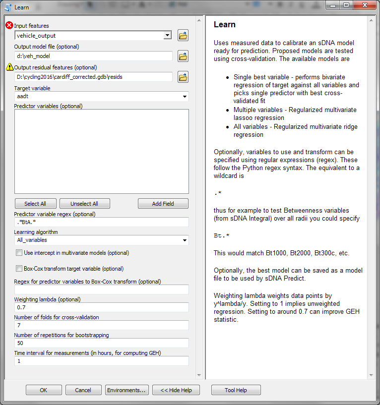

.. include:: <isonum.txt>

.. _`Step by step guides`:

**************************************
Step by step guides for specific tasks
**************************************

.. _`osm-step-by-step`:

Downloading and preparing data from OpenStreetMap
=================================================

NOTE: AS OF 2020 THIS SECTION IS LARGELY OUT OF DATE. OSM DATA CAN BE CONNECTED USING THE bpol OPTION IN GRASS v.clean; THIS HANDLES ALL INTERSECTIONS CORRECTLY.

OSM is a crowd-sourced mapping product and as such is particularly well supported by the open source community.  This tutorial therefore uses the free `QGIS`_.  

.. _QGIS: http://www.qgis.org/en/site/

Numerous online services exist for extracting OSM data into shapefiles.  One such service is Mapzen_:   Mapzen extracts come with more attribute data attached than most (including e.g. cycle routes) but are available only for urban areas.  If you need larger scale or rural OSM extracts, you may find other services suit your purposes better; the OSMDownloader plugin available within QGIS can also be useful.

.. _Mapzen: https://mapzen.com/metro-extracts/

OSM contains numerous types of lines feature beside roads and paths –
for example walls, fences and river banks. You will need to filter out
the roads and paths only. This can be achieved using ``Layer`` |rarr| ``Filter...``.  Results of a layer filter can be saved as a new layer using ``Layer`` |rarr| ``Save As...``; at the same time a new coordinate system can be chosen to ensure a suitable :ref:`projection` for sDNA analysis, and the saved layer can be restricted to selected features only, allowing extraction of the desired modelling area from the OSM download.

In Cardiff (as of November 2014) a road was present when the ‘highway’
field was set to one of the following: ``living_street, motorway,
motorway_link, primary, primary_link, residential, road, secondary,
secondary_link, service, services, tertiary, tertiary_link, trunk,
trunk_link, unclassified``. Note that other areas may differ, and these
classes may change over time. We recommend examining all values which
appear in the ‘highway’ field to decide for yourself which to use.

Cycle lane data (that is, presence of cycle lanes on roads) was not extensive enough to be useful, but data on cycle
routes (major cycle routes through cities) was consistent. Cycle routes do not necessarily denote highways,
but are a separate feature that coincides with the highways used. Some
of the marked cycle routes coincided with features which were classed as
paths rather than highways (a data inconsistency). Therefore it was
necessary to extract all candidate highways for cycle routes using the
following procedure:

-  Select all lines where ``route="bicycle"``

-  Create 5m buffers surrounding these lines

-  Create a new data field on the OSM data, “on\_cycle\_route”

-  Use spatial join to set on\_cycle\_route=1 for all OSM lines within
   the cycle route buffers

-  Use the filter ``highway IS NOT NULL AND on_cycle_route = 1`` to
   extract all highways coinciding with cycle routes.

With further use of the ``Filter`` tool it is possible to
create two fields on the extracted highway network:

-  cycle\_route – set to 1 if on a cycle route, 0 otherwise

-  car\_net – set to 1 if on car (road) network, 0 otherwise

Reducing such data to numeric values is important if it is to be
preserved during the :ref:`prepare` process, or if filtering of links is desired from :ref:`integral analysis`.

As of November 2014, the OSM data for Cardiff also contained a number of
connectivity and geometry errors. These were fixed by use of topology tools (ArcGIS ``Planarize`` or GRASS ``v.clean.advanced``).  OSM represents bridges and tunnels with non-intersected lines, so it is recommended to preserve this format.

1. Filter out bridges and tunnels (brunels), to avoid breaking them, using the SQL query::

      ("bridge" <> 'no' AND "bridge" <> ' ') or "tunnel" = 'yes'
    
   and save them to a new layer.
   
   It is strongly recommended to inspect all values which appear in
   the bridge and tunnel fields in order to be sure that you are capturing
   all information provided by OSM. In our case the bridge field could
   contain the values “”, “no”, “suspension”, “viaduct”, “swing”,
   “transporter” and “yes” - if these are present in your data, modify the query to account for them.

2. Filter out all other links::

      NOT (("bridge" <> 'no' AND "bridge" <> ' ') or "tunnel" = 'yes')
      
   (modified for other bridge types if necessary) and save them to a new layer.
   
3. On the "other links" layer run ``v.clean.advanced`` from the GRASS toolbox.  The GRASS tools are bundled with the free QGIS_, though to display them it is necessary to switch the 
   Processing toolbox to advanced mode.  (This is necessary for :ref:`firstuse` in any case).  For the ``Cleaning tools`` parameter, enter::
   
     snap,break,rmline
     
   and for ``threshold`` enter 1 (assuming a suitable coordinate system was chosen above, with units in metres).  This will merge nearby lines, remove duplicates, break at intersections and remove zero length lines.
   
4. Re-merge the cleaned "other links" with the brunel layer using ``Vector`` |rarr| ``Data Management`` |rarr| ``Merge Shapefiles to one...``

5. Run sDNA Line Measures on the merged data to compute connectivity.  Set layer properties to label each feature with connectivity (LConn).  Using the brunels layer as a reference, manually check that brunels have been correctly reconnected with ordinary links.  (If the attribute table for the brunels layer is opened, each feature can be selected and zoomed to in turn, and the corresponding feature on the merged class checked).
   
Modelling a combined vehicle and cycle network
==============================================

This tutorial is intended to illustrate the use of sDNA in practice. It
deals with one of the most complex tasks we have achieved with sDNA to
data; modelling a cycle network in which cyclists avoid motor vehicles,
slope and twistiness. However, several lessons for other model types
(vehicle and pedestrian) are illustrated by the same process, so the
example is worthwhile reading whatever your intended end use of sDNA.

The tutorial is written with sDNA and ArcGIS in mind, though could
apply to any GIS software. Steps specific to ArcGIS are written in
*italics.*  Some features (hybrid metrics, one way streets) are not available in standard sDNA, though
the principles of modelling remain the same.

sDNA cycle models are based on detailed behavioural simulation and have
various outputs including

1. Predicted vehicle flows

2. Predicted cyclist flows

3. Cycling accessibility – quantity and quality of provision

4. Effect of traffic and slope on accessibility

5. Roads with predicted conflicts between cyclist and motor vehicles

6. Maps of cycling flows to specific facilities

7. Maps of cycling accessibility to specific facilities

8. Quantification of change to accessibility caused by proposed scheme

All of these outputs can be used in two ways

1. For gap analysis, to identify areas of need prior to designing
   schemes

2. For evaluating proposed schemes

Additionally, the model can be based on network shape alone, or take
existing land use / commuting patterns into account. The alternatives
are

1. Land use weighted models. These allow for weighting origins and
   destinations within the network, e.g. homes and railway stations as
   origins, employers and retail as destinations.

2. Origin Destination (OD) matrix models (forthcoming in 2016). These
   allow input of an existing OD matrix, such as commuting flows from
   census data.

3. Network shape only models. These use only the network shape itself to
   predict flows.

Model types 1 and 2 are likely to have higher correlation with observed
flows than type 3, however type 3 (network only) models are the easiest
to produce and perhaps the most useful. Type 1 models incur the problem
of determining suitable weights for different types of land use. Both
type 1 and 2 models also make the assumption that existing land use and
commuting patterns will remain unchanged. In the long term this is not
true, as new developments occur and major employers open and close. Such
factors are typically outside the control of those analysing the network
in any case. It may be appropriate to model these factors in some cases,
for example, if there is an explicit need to design transport
infrastructure around an existing major employer. In most cases however
we recommend working with network shape only; although the models will
exhibit reduced fit to current data compared to other model types, they
are likely to remain more applicable in the long term.

The modelling process includes the following steps:

1. Create a routable vehicle and cycle network

2. Run the vehicle network model

3. Calibrate the vehicle model

4. Produce a cycle model informed by the calibrated vehicle model

5. (Optional) Calibrate the cycle network model. If this step is
   omitted, the cycle model will not show predicted counts but will
   still show relative levels of flow, which may be all that is needed.

6. Produce desired outputs from the cycle model

Production of a routable network
--------------------------------

This tutorial assumes a routable network accurate enough to use for
modelling is already available. Producing such a network is usually the
most time consuming part of any modelling exercise; fortunately in many
cases this step has been completed already, or if not, then good
material is already available to work with. OpenStreetMap for example
contains mapping of vehicle and cycle links in some areas.

General considerations when preparing a network for analysis are
discussed in :ref:`network preparation`. This is essential reading for all users of sDNA
models. More specific notes on Open Street Map can be found in :ref:`osm`
and a step-by-step guide to its use in :ref:`osm-step-by-step`.

A special consideration applies when producing a vehicle and cycle
model, namely that it must be possible to join (preferably with ease)
the predicted flows from the vehicle model to the cycle network. The
best way to do this is to produce a single input network for both
models, with two attached data fields to show whether access to each
link is permitted (i) by cars and (ii) by cycles. Results from different
model runs can then be joined easily by either geometry (spatial join)
or object ID.

Table 1 shows an example of a unified network format. In it, link 1 and
4 are ordinary roads traversable by both vehicles and cycles, link 2
would be a motorway accessible only to vehicles, and link 3 a (short)
section of traffic free cycle path. Links 2 and 4 have one way systems
in place, and link 2 ends on a bridge (shown by the grade separation
field end\_gs – to be discussed below). Link 5 is not a real network
link but represents a city outside the model containing a million links.
The “start” and “end” of the grade separation fields, and also the one
way data, refer to the direction in which the link is drawn in the
graphics program or GIS rather than any “natural” direction it has.

+-------------+----------------+----------+-----------+--------------+-----------+-------------+-----------+
| Object ID   | Shape length   | carnet   | bikenet   | onewaydata   | weight    | start\_gs   | end\_gs   |
+=============+================+==========+===========+==============+===========+=============+===========+
| 1           | 42.6           | 1        | 1         | 0            | 1         | 0           | 0         |
+-------------+----------------+----------+-----------+--------------+-----------+-------------+-----------+
| 2           | 89             | 1        | 0         | 1            | 1         | 0           | 1         |
+-------------+----------------+----------+-----------+--------------+-----------+-------------+-----------+
| 3           | 2              | 0        | 1         | 0            | 1         | 0           | 0         |
+-------------+----------------+----------+-----------+--------------+-----------+-------------+-----------+
| 4           | 8.4            | 1        | 1         | -1           | 1         | 0           | 0         |
+-------------+----------------+----------+-----------+--------------+-----------+-------------+-----------+
| 5           | 1              | 1        | 1         | 0            | 1000000   | 0           | 0         |
+-------------+----------------+----------+-----------+--------------+-----------+-------------+-----------+

Table 1. Sample excerpt from combined cycle and vehicle network

If the road network data encodes dual carriageways as separate links
(that is, each half of the dual carriageway is represented by its own
link in the network) then it is essential to ensure simulated vehicle
traffic makes use of both sides of the carriageway. If this is not done,
all vehicle traffic will take the most convenient side, leaving the
other as an apparently useful traffic free cycle route. Obviously this
does not happen in reality, because dual carriageways carry an explicit
or implicit one way traffic restriction per side. The most reliable way
to ensure correct usage of dual carriageways is therefore to input one
way information into sDNA [1]_. Table 2 shows how sDNA interprets one way data.

+----------------+----------------------------------------+
| One way data   | Meaning                                |
+================+========================================+
| 0              | Traversal in both directions allowed   |
+----------------+----------------------------------------+
| 1              | Forwards traversal only                |
+----------------+----------------------------------------+
| -1             | Backwards traversal only               |
+----------------+----------------------------------------+

Table 2. sDNA encoding of one way data. “Forwards” and “backwards”
relate to the direction in which the link is drawn in the graphics
program or GIS.

A third consideration in producing combined vehicle/cycle models is that
vehicle network information will probably be needed for a much wider
area than cycle network information. Table 3 gives an example. If we
wish to model cycle flows within a city, we must make the cycle model
slightly larger than the city itself to correctly model flows over the
boundary in and out of the city. The vehicle model must in turn be quite
a lot larger, in order to deduce where the medium distance traffic is
travelling from and to. Although most vehicle trips are short, longer
trips tend to aggregate to major through routes, so if we want to
estimate the level of traffic on a major through route such as a
motorway then we must also include some trips of at least medium length.

The best size of model to use will vary depending on travel behaviour in
an area, but fortunately, spatial network models are not overly
sensitive to the exact model size used. This is because network problems
have a high level of *collinearity*, e.g. a link that is useful for 50km
trips is also likely to be useful for 30km trips, so both types of model
will be able to identify realistic patterns of flow.

+-----------------------------------------------+--------------------------------------+
| Area                                          | Radius from model centre (example)   |
+===============================================+======================================+
| Desired modelling area e.g. city-wide model   | 8km, as measured along network       |
+-----------------------------------------------+--------------------------------------+
| Cycle network model                           | 12km, as measured along network      |
+-----------------------------------------------+--------------------------------------+
| Vehicle network model                         | 30km, as measured along network      |
+-----------------------------------------------+--------------------------------------+

Table 3. Example of nested models

As the vehicle model we need is larger than the cycle model, note that
in a unified model *we do not need cycle route information for the wide
scale vehicle network.* Also, at greater distances from the study area,
there is even a reduced need for accuracy in the vehicle network. It is
included in the model purely as a source and sink for traffic, and so
long as the major routes to major neighbouring towns/cities are
included, the model is sufficient. This can be checked after running the
model by inspecting the predicted flows to these places.

A fourth consideration is modelling of elevation and grade separation in
the network.

1. Elevation measures the height of each point above ground. Use of
   elevation data makes cycle models more accurate as slope affects
   cyclists behavioural choices. sDNA reads network features in 3d,
   which therefore includes elevation if present. Typically, network
   data is downloaded, corrected and prepared in 2d form then *draped*
   over a 3d terrain model to produce a 3d network. (In ArcGIS:
   *ArcToolbox* |rarr| *3d Analyst* |rarr| *Functional Surface* |rarr| *Interpolate
   Shape*).

2. Grade separation relates to points where links cross, such as bridges
   and tunnels. (These are collectively referred to as brunels). Although in theory this is determined by elevation, the available elevation data may not be preciseWhether
   enough to distinguish different levels of a brunel, particularly if data has been obtained by draping over a terrain model.  sDNA will thus accept grade separation data
   in addition to elevation.
   
   Whether
   or not it is necessary to give sDNA grade separation data depends on
   how brunels are geometrically encoded. In some network data, links
   which pass over or under one another are represented by lines which
   intersect but are not noded; in these cases grade separation is not
   needed. More commonly however, a node is placed at such points even
   though there is no connection between the links; in the latter case,
   grade separation data is needed to inform sDNA that there is no
   connectivity. :ref:`network preparation`
   discusses this topic in more detail.

A final consideration with the wider vehicle network model is whether to
model the wide network in detail. Such modelling is computationally
expensive and may not be needed. In some cases, e.g. where a
neighbouring city is accessed by only one route, the entire neighbouring
city can be discarded from the model and replaced with a single
*weighted* network link. If this is the case, the weighted link should
be added to the network at the same distance from the model area as the
city it replaces. The special link would be weighted by the number of
links in the city it replaced, while all normal links would be assigned
a weight of 1. An example was shown in Table 1.

Running the vehicle network model
---------------------------------

To run the vehicle network model, follow these steps.

1. Decide on a set of radii (maximum trip lengths) to model. For
   example, 15, 20, 25, and 30 kilometres. As discussed above, the exact
   lengths are not important, so much as having a range of sensible
   values which will later be tested for their fit to actual vehicle
   flows.

2. Configure sDNA integral. :num:`Figure #vehintegralconfig` shows an example. The type of
   analysis chosen is “ANGULAR”. This means that all vehicle traffic
   attempts to take the straightest route, which is a good approximation
   to driver behaviour. Radii are expressed in metres (assuming the
   underlying data is projected to a coordinate system measured in
   metres – see :ref:`network preparation`
   for more detail). Weights are taken from the “weight” field to allow
   modelling of distant cities efficiencly. Links not in the car network
   are disabled by putting ``!carnet`` (the opposite of the carnet field)
   into the “disable links” expression. One way information is taken
   from the *oneway* field.
   
   **UPDATE** We now recommend selecting "Banded radius".  This means each radius will represent only trips in the relevant distance band (e.g. 20-25km) rather than all trips below the band (0-25km).  
   This helps with multivariate modelling.

3. Run sDNA Integral. For a 50km urban network this will likely take a
   few hours to run. *At time of going to press, a bug in ArcGIS
   prevents progress information being displayed if the model runs in
   the background. There are two workarounds to this. Either use sDNA
   from the command line or QGIS, or disable background processing in
   Geoprocessing* |rarr| *Geoprocessing options.*

4. Display the model results. The parameter of interest is Angular
   Betweenness (BtA) at each radius. At this time, simply check that the
   results look like a sensible flow map, with major roads identified as
   having high levels of flow.

.. _vehintegralconfig:

.. figure:: vehanal.PNG

   sDNA Integral configuration for vehicle model.

Calibrating the vehicle model
-----------------------------

Angular Betweenness output from the vehicle model represents the level
of predicted flow for each maximum trip length, so shows relative
traffic levels on the roads in the model. To calibrate, we compare
Betweenness with actual traffic flow data to achieve two things; (i)
determine which radius of Angular Betweenness best fits actual flows;
(ii) determining the multiplier (coefficient) that will convert this
radius of Betweenness into an actual count of, say, annual average daily
traffic (AADT).

The first requirement for calibration is to get hold of some vehicle
flow data. In the UK this is freely downloadable from the Department for
Transport [2]_. Vehicle flow data may come in the form of a table that
includes grid references for each count point; in this case it will need
converting to a spatial format to display (*In ArcGIS File* |rarr| *Add Data
|rarr| Add XY Data*). The vehicle data can then be cropped to the model
area. It is only necessary to use vehicle points from within the cycle
network model – those that fall in the extended vehicle network can be
discarded. Obviously the more points are available, the better the
calibration can be, but models can be effectively calibrated using fewer
than 50 points.

The points must then be checked, and possibly adjusted, so that it is
clear which link in the model each point is supposed to attach to.
Depending on your network geometry, the recorded points will probably
not fall exactly on links in the model. It is also often the case that
vehicle flow data reports the flow on dual carriageways as the total
flow in both directions, rather than counting each side of the
carriageway separately; in these cases therefore a recorded point
relates to two links rather than one. The aim of the adjustment process
is to prepare the data such that the *Join* function of any GIS will be
able to link each flow to the correct link(s). Points which are
ambiguous (i.e. it is not certain which link they relate to) must be
discarded.

If the model requires summing flows from both halves of a dual
carriageway, it is advisable to encode measured flows as *gates* rather
than single points. A gate is a line drawn so as to intersect all the
links it measures (and only links it measures). It is relatively easy to
iterate through the set of flow data points, and create by hand a new
feature class containing lines that fulfil this purpose; a GIS spatial
join function can then be used to join each line (gate) to the nearest
recorded flow point.

Once a correct and unambiguous set of vehicle gates has been created,
these are again *joined* to the output from the vehicle model. The
resulting data should be the same set of vehicle gates, augmented by the
network data from the link(s) that each gate intersects. This means
using the gates as the primary layer for the *join* (otherwise we would
end up with the entire network augmented by the vehicle gate data – a
much larger dataset and not what is wanted).

The process of calibration can then proceed. We now do this by
combining predictions in whichever way best predicts flows using *multivariate ridge regression*. 

Regression fits a line to the plot of flows against
predictions, as shown in Figure 2. We measure how well the regression has worked using  *proportion of variance
explained*, or :math:`r^{2}`. :math:`r^{2}` can range from 0 (for a
useless model) to 1 (for a perfect model). High :math:`r^{2}` is
preferable, but low :math:`r^{2}` does not necessarily indicate a bad
model: it can also be caused by errors in measurement, especially with
cycle flows. Even if there is a lot of variability the model cannot
predict, the component that can be predicted can form a useful basis for
decision making.

Vehicle traffic flows on roads (real or predicted) do not have a normal
distribution. That is to say, most of the traffic is actually carried by
a small subset of roads. This means we should not weight all data points
equally. Additionally, transport planners do not weight data points equally,
instead using a statistic called GEH to balance absolute and relative errors.

To account for this, we weight data points by setting 
lambda to a value between 0 (weight to minimize relative errors) and 1 (weight to minimize absolute errors).  In practice, values around 0.7 tend to minimize GEH.

If running a bivariate model (SINGLE_BEST) we can choose instead to Box-Cox transform variables to achieve the same thing, but this is not recommended for multivariate models (MULTIPLE_VARIABLES or ALL_VARIABLES).

1. *Join* the vehicle gates to the network (*Right click vehicle gates
   layer in table of contents; Joins and relates, Join..., Join data from
   another layer based on spatial location*).

2. Load sDNA Learn and configure it as in :num:`Figure #sdnalearnconfig`. The output model is to
   be saved at ``d:\\veh_model``. The target variable is ``aadt`` (annual
   average daily traffic). Note use of a regular expression ``.*BtA.*`` to
   select ALL angular betweenness variables as potential predictors at
   once.

.. _sdnalearnconfig:

   sDNA Learn configuration for calibrating vehicle model.   
   
3. Inspect the outputs of sDNA Learn. Which variables were used and with what weighting? Is 
   :math:`r^2` good enough?  If so then jump to step 5.

4. If :math:`r^2` is not good enough, inspect residuals output by sDNA Learn: plot a graph of
   actual flow against prediction *(View* |rarr| *Graphs*
   |rarr| *Create graph).*  (*These can be selected on the graph to locate them
   on the map)*. 
   
   Try to figure out where errors come from.  They are likely to arise 
    
    (a) from network errors; in which case it is worth checking why traffic is not taking the route
    you expect - perhaps some links are not connected when they should be?  
    
    (b) because some behaviour that happens in reality is not accounted for in the model; e.g. flows to town centre or some specific facility, people navigating by means other than most direct route.
    If desired, run extra models and combine with the existing ones before running sDNA Learn on the outputs of all models together.
    
   See also :ref:`troubleshooting`.

5. Once you are happy with :math:`r^2`, use sDNA Predict to predict aadt on the whole network, based on the model file (``d:\veh_model``).  Note that if your vehicle gates consist of lines rather than points, the variable names must be changed slightly.  For example, a variable called ``Sum_BtA25000`` on the *gates* would be called ``BtA25000`` on the *network*.  The model file is a plain text file and can be edited to rename the variables as appropriate.

Calibration is now complete and the AADT field contains traffic
predictions for each link in the combined network.

.. figure: calibrationgraph.PNG
    
   Example of fitting a straight line to a graph of all motor
   vehicles (measured) against Betweenness at 31km (predicted). Both
   variables have had their cube root taken to make distributions more normal.

Production of the cycle model
-----------------------------

Now that a calibrated estimate of vehicle traffic is present on the
entire network, it is possible to produce a cycle model that takes
account of vehicle traffic.

If using a unified network, we can now take a copy of only the desired
study area plus buffer to account for cycle flows in and out of the
area. Most cycle trips are not likely to be more than 4km in length, so
this means the study area plus 4km (though a larger distance can be used
if desired). Although distances should be measured along the network, it
is fine to use simple selection tools and measure these distances as the
crow flies – the result will only be that a slightly larger network is
used. The actual trip lengths in the simulation are determined by the
radius requested of sDNA.

It is worth checking at this point that elevation data has been
correctly transferred to the network. One way to do this is to run sDNA
Individual Link Measures, with a hybrid metric that captures slope.

1. Run sDNA Individual Link Measures with analysis type set to HYBRID, and the following
   advanced config: ``linkformula=hg+hl``

2. Check that Hybrid Metric Forward (HmF) in the results from (1)
   highlights network links which slope.

3. Run a cycle model. This is again achieved by running sDNA Integral
   with the analysis type set to CYCLE_ROUNDTRIP.  Set the Radial Metric to MATCH_ANALYTICAL: this means the radius is measured as CYCLE_ROUNDTRIP as well.  
   
   Choose a variety of radii e.g. 3000, 4000, 5000, 7000, 9000, 12000, 15000, 18000.  These are distances in metres adjusted for factors that deter cyclists: slope, traffic and twistiness.  Note that CYCLE_ROUNDTRIP uses round trip distances to account for the fact that going downhill is a deterrant if the cyclist must come back up the hill later.
   
   Again, choose *Banded Radius*.
   
The sDNA cycle modes are derived from prior research on cyclist
behaviour. It is a special case of hybrid analysis. If you
inspect the output of sDNA, the equivalent hybrid formula is shown.

Calibration of the cycle model 
-------------------------------

The cycle model can be calibrated in much the same way as the vehicle
one.

If no cycle flow data is available, then an uncalibrated model can be
obtained by guessing at which radius of hybrid betweenness to use for
the output. The most effective radius from cities similar to the study
area would be a reasonable starting point.

If cycle flow data is available, then the best radius is selected using
sDNA Learn in the same way as it was for the vehicle models. Having done
this, it may or may not be necessary to convert the chosen betweenness
variable into a predicted daily flow. The betweenness variable will
already show relative levels of flow.

If predicted flows don't seem to match actual flows, see :ref:`troubleshooting`.

Recommended model outputs
-------------------------

Predicted vehicle flows
^^^^^^^^^^^^^^^^^^^^^^^

These are present on the vehicle network, labelled “aadt” (or whatever you chose to call them during calibration).

Predicted cyclist flows 
^^^^^^^^^^^^^^^^^^^^^^^

Uncalibrated flows are available as Betweenness Hybrid for varying maximum trip distances.  Calibrated flows will be in a variable of your own creation if the calibration process is followed.

Accessibility
^^^^^^^^^^^^^

Accessibility is measured by computing network quantity within each distance band.  It can thus be measured by the Links, Length or Weight variables, so long as the radial metric is set appropriately (e.g. CYCLE_ROUNDTRIP).  If the model is calibrated, you have a few possible approaches

(a) quick and approximate: run a cycle model *without* using banded radius.  Use sDNA learn in SINGLE_BEST mode to see which *single* radius best explains cyclist flows, and then measure accessibility for this radius.

(b) more sophisticated: keep the cycle model based on banded radius.  Edit the model file, replacing BtH with Links, Length or Weight as appropriate, then use sDNA Predict to combine accessibility measures across multiple radii in the manner that best explains cyclist flows.

(c) If mode choice data is available, use sDNA Learn and Predict on the banded cycle model to produce predictions of mode choice.  Use predicted mode choice as your definition of accessibility.

Higher numbers show higher quantity of network.  

.. _etsa: 

Effect of traffic and slope on accessibility
^^^^^^^^^^^^^^^^^^^^^^^^^^^^^^^^^^^^^^^^^^^^

This is measured by comparing accessibility from the cycle model with an alternative model with no slope or traffic.  

First add a numeric field to the network called "zero" and set it to 0 for all links.  This is used to simulate zero traffic!

Run a second cycle model as described above but provide the following advanced config: ``aadt=zero;s=0;pre=no_slope_traffic_``

``s=0`` sets the effect of slope to 0.   ``aadt=zero`` tells sDNA to use the contents of your "zero" field (which you set to 0) as the traffic estimate.

``pre=no_slope_traffic_`` changes names for the outputs of the second model for clarity.

Now join the output of this second model back to the original model.  Add and compute a data field to work out :math:`\text{accessibility without traffic and slope}/\text{accessibility with traffic and slope}`.  (ArcGIS: computing  a field is not necessary.  Instead, in the Symbology dialog, select accessibility without traffic/slope as Value and accessibility with traffic/slope as Normalization).

The results are expressed as a ratio, where 1 means traffic and slope have no effect, 2 means traffic and slope make accessibility twice as difficult, etc.

Note that producing flow predictions in the absence of traffic is also possible, and comparing these to flow predictions with traffic can also suggest hotspots to consider for infrastructure improvement.

Effect of traffic on accessibility
^^^^^^^^^^^^^^^^^^^^^^^^^^^^^^^^^^

As :ref:`etsa`, but use a different advanced config: ``pre=no_traffic_;aadt=zero``

Predicted conflicts
^^^^^^^^^^^^^^^^^^^

Create a variable that multiples predicted cycle flows by predicted vehicle flows.  *(ArcGIS: use Add Field and Calculate Field in ArcToolbox - Data Management - Fields)*.  The numbers are an unscaled score indicating relative risk of conflict.  Display using only two categories, manually selecting a suitable threshold to identify the links with more conflict potential.  The threshold should be set according to need; in terms of identifying incident sites: 

* High thresholds increase the rate of both true and false negatives 
* Low thresholds increase the rate of both true and false positives

.. _specificflows:

Flows to/from specific facilities
^^^^^^^^^^^^^^^^^^^^^^^^^^^^^^^^^

Run a cycle model again, but weighted by the specific facility.  This means creating a weight field on the network to denote the facility.  

1. Add a field named station, hospital, etc
2. Set this field to 0 everywhere except for the facility site where it should be set to 1 *(ArcGIS: add field, calculate field for 0, then edit the facility itself to set field to 1)*. 
3. Run a cycle model with analysis type set to CYCLE_ROUNDTRIP and destination weight set to the field created in (1).
4. Display Betweenness Hybrid for the appropriate radius

Accessibility to/from specific facilities
^^^^^^^^^^^^^^^^^^^^^^^^^^^^^^^^^^^^^^^^^

As for :ref:`specificflows`, but display Mean Hybrid Distance (MHD) for the appropriate radius.  

Change to accessibility caused by proposed scheme
^^^^^^^^^^^^^^^^^^^^^^^^^^^^^^^^^^^^^^^^^^^^^^^^^

This is measured by comparing accessibility as described above, from the current cycle model with an alternative model including the proposed scheme.  Run a second cycle model that includes the new scheme and use GIS Spatial Join to bring data from the two models together.  It may help to add ``pre=before_`` or ``pre=after_`` to advanced config to label the model outputs differently.

This value can be mapped to show improvement in accessibility, i.e. 1.23 = 23% more destinations to access for the same effort.  Alternatively, it can be summed over the entire model to produce a score representing both the increase in accessibility, and the quantity of network that experiences the improvement.

Displaying model outputs
------------------------

Recommended outputs from the model are discussed below.

We recommend using
“graduated colours” symbologies, but modifying the highest bands of any
key to display with thicker lines for extra emphasis. 

-  For flows, we recommend Geometrical Interval classification to give
   equal emphasis of high and low flows. This is to reflect the fact
   that flows tend to be exponentially distributed, i.e. most links have
   little flow but a few links have very high flow.

-  It is also possible to display flows using Quantile or Jenks
   classification. This will condense bands of higher flows and provide
   more discernment of low level flows.

-  For accessibility measures, we recommend Quantile or Jenks
   classification

-  In some cases, e.g. ratios of accessibility, using manual
   classification may be useful, e.g. to create a special category for
   ratios equal to 1. A quantile classification can make a useful starting point for a manual one.

*In ArcGIS, data on networks is displayed by right-clicking on a layer
in the table of contents,* |rarr| *properties* |rarr| *symbology.  For any display,
click “Classify” from the symbologies dialog to determine how continuous
data such as predicted flows is banded into categories.*
   
*With larger data sets, ArcGIS will warn that not all data has been
sampled to create the classification. This is ill advised as some
high-flow links may then fail to display altogether. To ensure all data
is sampled, click “Classify” to set a higher number of features to
sample.*

.. [1]
   An alternative is to use a hybrid metric for vehicle route choice that includes a random component, so that vehicle routes are distributed between both sides of the
   carriageway. This may prove useful in cases where one way data is not
   available.

.. [2]
   Note that the DfT release major road and minor road data separately.
   For effective calibration it is necessary to download both data sets
   and merge them.

